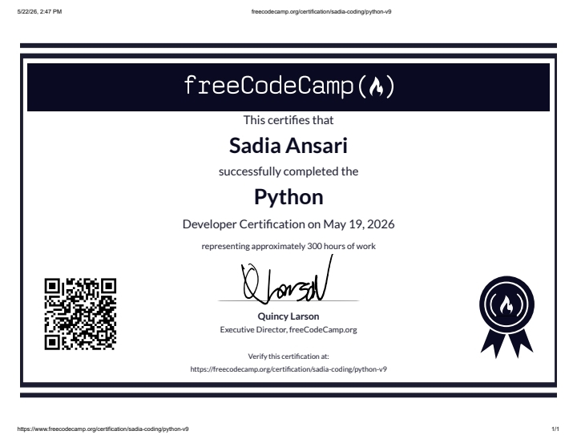

# My Python Certification

Welcome to my repository! This project showcases my Python certification and the skills I have acquired during my learning journey.

## 📜 Certificate
Here is my official Python completion certificate:

---

## 🛠️ Skills Learned
During this certification, I gained hands-on experience in the following areas:
* **Core Python:** Variables, Data Types, and Operators.
* **Control Flow:** Loops (`for`, `while`) and Conditional Statements (`if-else`).
* **Data Structures:** Lists, Dictionaries, Tuples, and Sets.
* **Functions & Modules:** Writing reusable code and importing external libraries.
* **Problem Solving:** Logical thinking and basic algorithm implementation.

---

## 🚀 How to Connect
If you want to connect with me or discuss Python projects, feel free to reach out:
* **GitHub:** [sadiacoding](https://github.com/sadiacoding)
